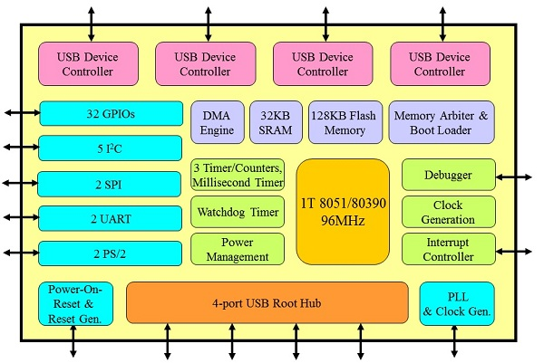
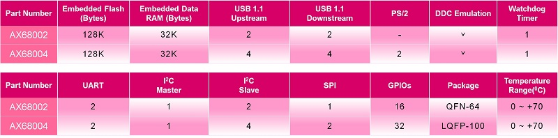

# [AX68004](https://github.com/sochub/AX68004)

#### 厂商：[asix亚信](https://github.com/sochub/asix)
#### 架构：[8051](https://github.com/sochub/8051)

AX68004系列单片机是比较少见的KVM 控制器，集成8051内核，拥有丰富的外设资源

###  [收录资源](https://github.com/sochub/AX68004)  

##  [SoC资源平台](http://www.qitas.cn)